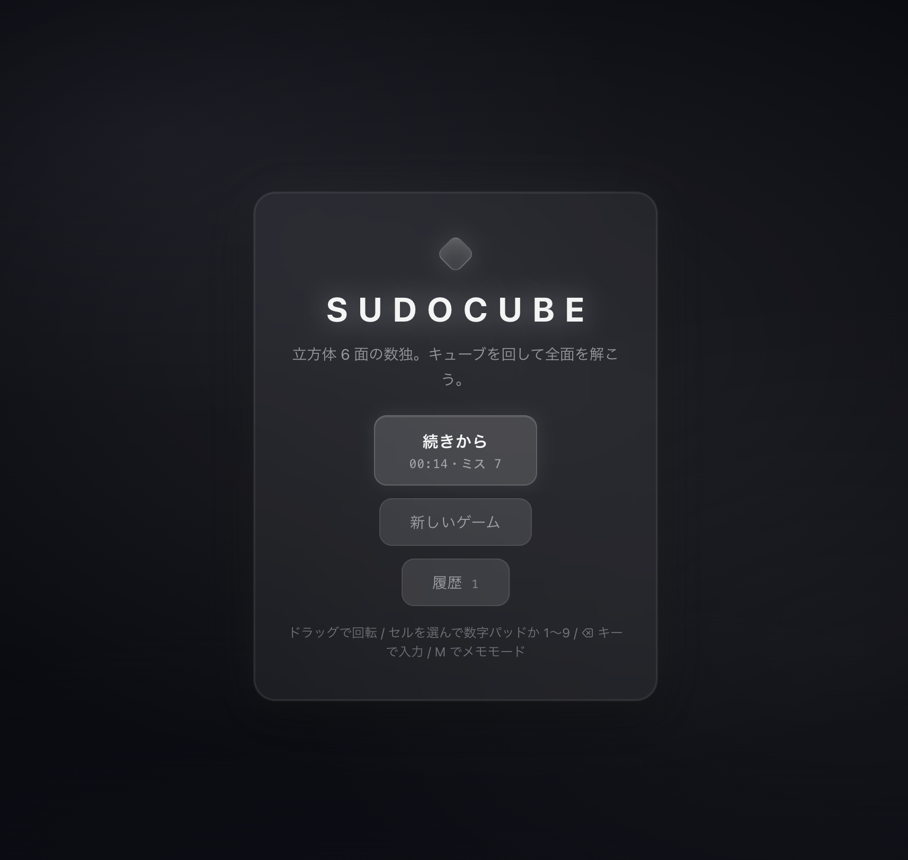
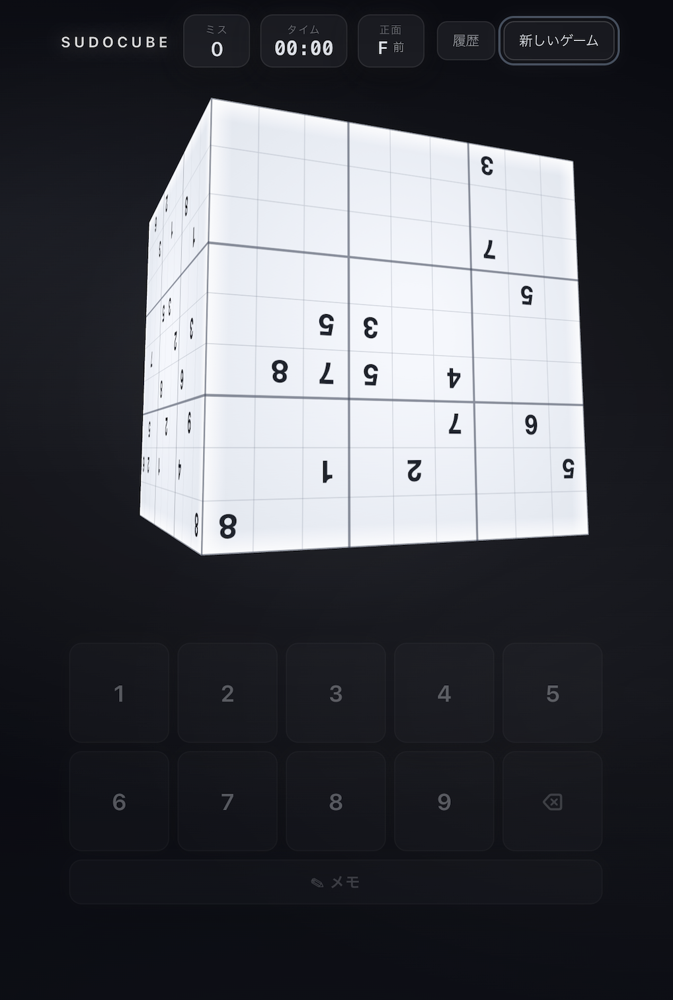

[English](README.en.md) | 日本語

<div align="center">

# 🧊 Sudocube

### 数独を、立方体の6面に。

**Sudocube** は、ふつうの数独を立方体の6面へ展開したブラウザパズル。<br/>
各面は9×9の数独として成立しつつ、**隣り合う面が辺で数字を共有する**。<br/>
立方体を回しながら、6面すべてを同時に矛盾なく埋めきろう。

🎮 **[Play Now — naoya25.github.io/sudocube](https://naoya25.github.io/sudocube/)**




</div>

---

## ゲーム概要

|  | ふつうの数独 | Sudocube |
|---|---|---|
| 盤面 | 9×9 が1枚 | 9×9 が **6面**（合計486マス） |
| 面をまたぐ制約 | なし | **辺12本・頂点8個**で数字を共有 |
| 1マスが属する制約 | 行・列・ブロック | それ + **共有相手の面**の行・列・ブロック |

- 各面は通常の数独（行・列・3×3ブロックに 1〜9 が1つずつ）
- 隣り合う2面は、接する辺の9マスを**同じ数字**で共有する（立方体の同じ辺だから）
- 頂点（角）では3面が集まり、3つのマスが同じ数字になる

辺で繋がったマスは、自分の面と隣の面の両方のルールを同時に満たす必要がある。1つの数字が複数の面へ波及する——これが Sudocube 独自の「面をまたぐ推論」を生む。

→ ルール詳細は [docs/rules.md](docs/rules.md)、幾何の裏付けは [docs/geometry.md](docs/geometry.md)

## 特徴

- **3Dキューブ盤面** — ドラッグで回転（軸ロック式で旋回しない）、強フリックで慣性回転して減速後に最寄り姿勢へ吸着。静止時は常に24姿勢のどれかにスナップし、数字は姿勢にかかわらず画面に対して正立する
- **イントロ回転演出** — ゲーム開始時、斜め姿勢からタンブル回転して正面へ着地
- **候補数字メモ（鉛筆メモ）** — メモモードで候補をトグル。辺・頂点の双子セル間でメモが同期し、正解を入力すると peers（同じ行・列・ブロック・双子経由の面またぎ先）のメモから同じ数字が自動で消える。same-number ハイライトはメモの候補数字にも効く
- **マルチセーブ + 履歴ページ** — 進行中ゲームを複数スロットで自動セーブ。履歴ページから任意のセーブを再開・削除（2度押し確認）でき、クリア済み戦績と BEST タイムも一覧できる
- **その場でユニーク解生成** — seed 決定的な生成器が、完成盤面を作ってから掘り進め、解が一意な問題だけを出す
- **エセリアルデザイン** — ガラスと淡い光のダークテーマ固定。モバイル（タッチ操作・縦画面 HUD）対応

## 操作方法

| 操作 | マウス / タッチ | キーボード |
|---|---|---|
| キューブ回転 | 盤面外をドラッグ / フリック | — |
| マス選択 | マスをタップ / クリック | 矢印キー（正面の面内を移動） |
| 数字入力 | 数字パッド | `1`–`9` |
| 消す | 消しゴムキー | `⌫` / `Delete` / `0` |
| メモモード切替 | パッドの ✎ キー | `M` |
| 候補メモをトグル | メモモード中に数字パッド | `Shift` + `1`–`9` |

## 技術構成

- **Vite 8 + React 19 + TypeScript**、3D は **three.js + @react-three/fiber**、Lint は oxlint、テストは Vitest
- **React 非依存の core ロジック**（`src/core/`）— geometry（辺・頂点の自動対応）/ board / solver / generator（seed 決定的・ユニーク解保証）/ session（入力・ミス・スコア）/ notes / persistence（マルチスロットセーブ）を純粋 TypeScript で実装し、単体テストで担保
- **描画** — 面ごとに CanvasTexture 6枚を貼り、「24姿勢 × 6面 → グリフ正立角」テーブルを precompute して数字を常に正立描画

→ 設計メモ: [docs/overview.md](docs/overview.md) / [docs/data-structure.md](docs/data-structure.md) / [docs/generation.md](docs/generation.md)

## 開発

```bash
git clone https://github.com/naoya25/sudocube.git
cd sudocube
npm install
npm run dev      # 開発サーバー
npm run test     # Vitest (core ロジックの単体テスト)
npm run lint     # oxlint
npm run build    # tsc -b && vite build
```

デプロイは main へ push すると GitHub Actions が自動でビルドし GitHub Pages へ公開する（[deploy.yml](.github/workflows/deploy.yml)）。

→ 経緯・今後は [docs/roadmap.md](docs/roadmap.md)

## ライセンス

MIT License を予定（`LICENSE` ファイルは追加予定）。
